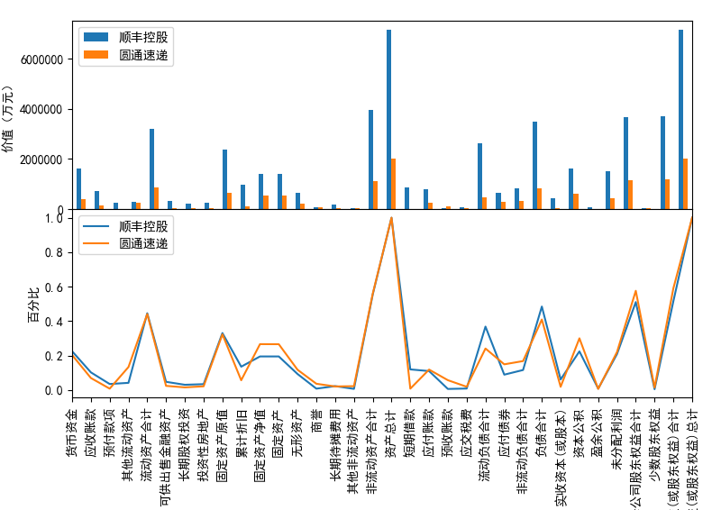
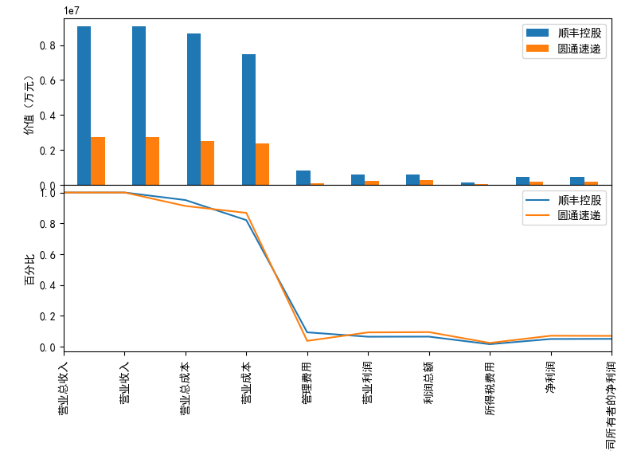

`fi-tool`不是一款专用软件，也没有特别设计意图。它只是在自己阅读和证券实践的过程中一
些零碎想法的实现。

`fi-tool`由Python语言编写，目前以脚本的形式提供如下简易功能：

- 交易记录分析
  - 从给定的交易数据里面提取以月为单位的最低价、最高价。
    - 结果保存为csv格式的文件。
    - 并提供绘图。
- 财务报表分析
  - 单只股票的分析
    - 从给定的资产负债表和利润表提取数据进行同型分析、资产评估、盈利评估。
    - 资产评估结果保存为csv格式的文件。
    - 利润评估结果保存为csv格式的文件。
    - 支持资产负债表、利润表同型分析的绘图。
  - 多只股票的分析

# 使用说明

*注：目前仅在 Windows系统上进行开发测试。* 运行脚本命令之前需要提前准备如下事项：

- `...\fi-tool\src`目前作为工作目录，在执行命令之前先切换到`src`目录。
- 针对交易记录的分析，需要拷贝名称为`002352.csv`的原始数据至`.\data\trade`目录。
- 针对年报数据的分析，需要拷贝名称为`zcfzb002352.csv`的资产负债表原始数据，以及名称为
`lrb002352.csv`的利润表原始数据至`.\data\report`目录。

## 交易记录分析

目前仅支持单只股票的交易记录分析，如果在命令中传入了多只股票编码，默认处理第一只股票。

- 得出基于月份的最低、最高价

```
python start.py -s 002352 --option trade
```

- 指定交易时间段

```
python start.py -s 002352 -o trade --startdate 201501 --enddate 201808
```

## 单只股票分析

- 资产负债表分析

当前仅支持同型分析（比率分析），输出结果：

  - 资产部分同型分析（图示）
  - 负债部分同型分析（图示）
  - 资产评估csv文件

```
python start.py -o balance -s 002352
```

- 利润表表分析

当前仅支持同型分析（比率分析），输出结果：

  - 利润表同型分析（图示）  
  - 资产评估csv文件

```
python start.py -s 002352 -o income
```

## 多只股票对比

在对多只股票进行对比分析的时候，默认以最近一个会计年度的报表数据进行对比。目前支持针对多
只股票的资产负债表项目和利润表项目进行对比，绘制图形从绝对值和百分比两个角度进行展现。

### 资产负债表对比

```
python start.py -s 002352 600233 -o balance
```



### 利润表对比

```
python start.py -s 002352 600233 -o income
```


